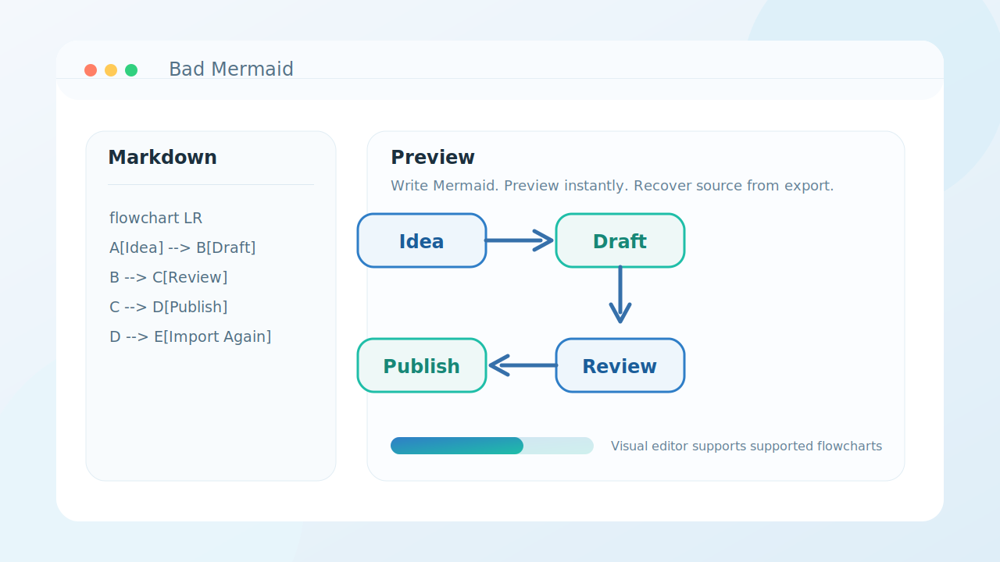

# Bad Mermaid

Bad Mermaid is a small browser-based Mermaid workspace for writing diagrams, previewing them, exporting them, and restoring the original Mermaid source from exported files.



## Features

- Write Mermaid flowchart syntax in a text editor
- Render the diagram in the browser
- Switch between a rendered preview and a lightweight visual editor for supported flowcharts
- Export diagrams as `SVG` or `PNG`
- Re-import exported `SVG` or `PNG` files to recover the embedded Mermaid source

## Deployment

- [Deploy to Vercel](./DEPLOY_VERCEL.md)

## Notes

- Source recovery only works for files exported from this app, because the Mermaid source is embedded as metadata during export
- Importing an arbitrary screenshot of a diagram is not supported
- The visual editor currently supports normalized Mermaid flowcharts only

## Run Locally

The app is a static site, so the simplest way to run it locally is with a basic HTTP server:

```bash
cd bad-mermaid
python3 -m http.server 8080
```

Then open:

```text
http://localhost:8080
```

## Tech Stack

- HTML
- CSS
- Vanilla JavaScript
- Mermaid

## License

MIT
